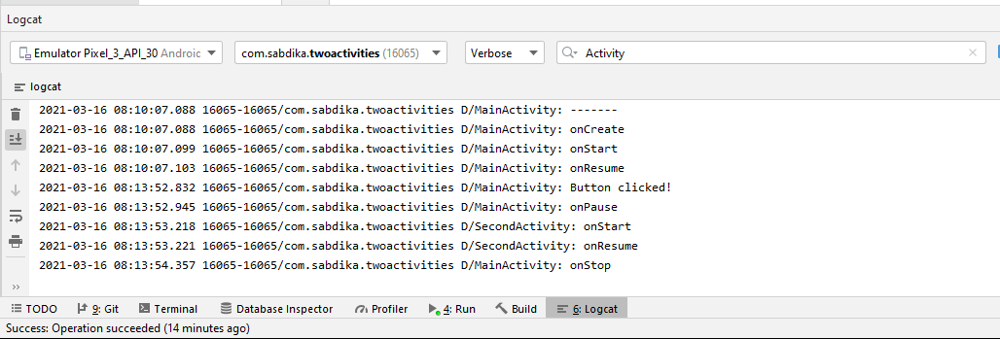
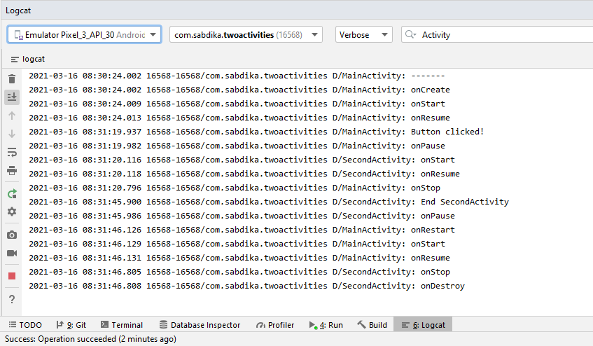
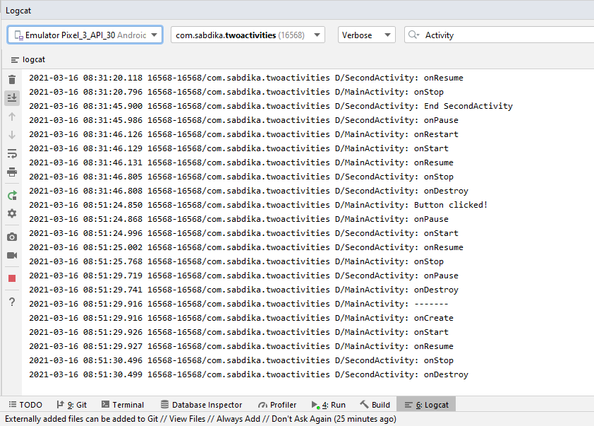
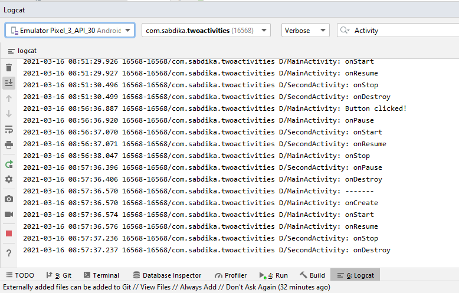

## Add lifecycle callbacks to TwoActivities

## Logcat after sending a message, reply with another message

## Logcat after Use of the Up arrow in the app bar to go back from the second Activity to the main Activity.

## Logcat after rotation in second Activity and main Activity.
